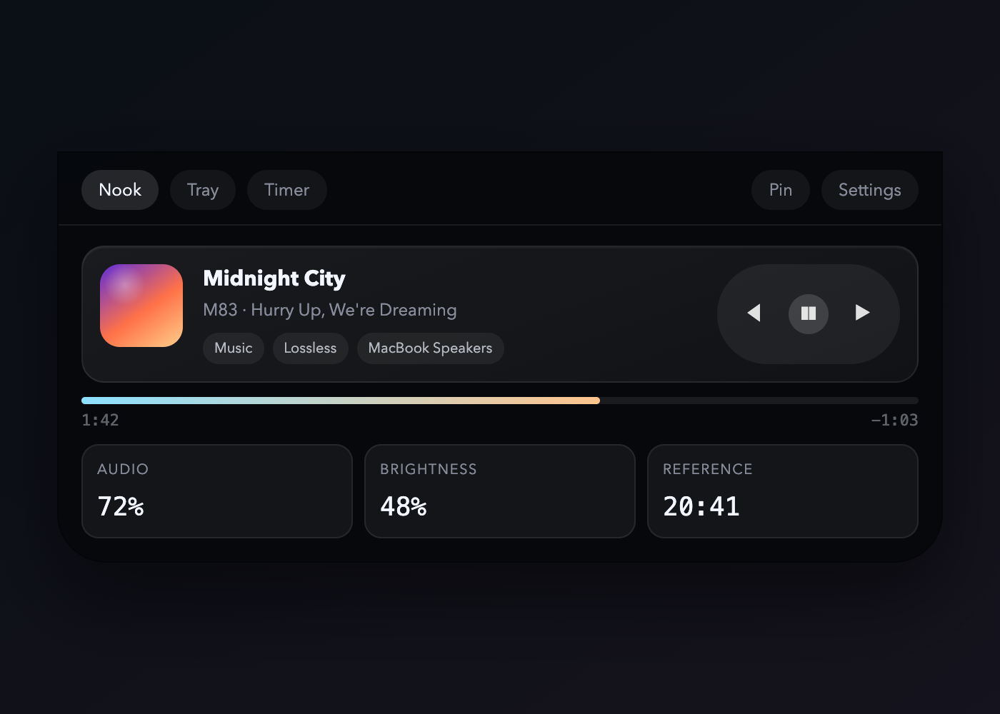
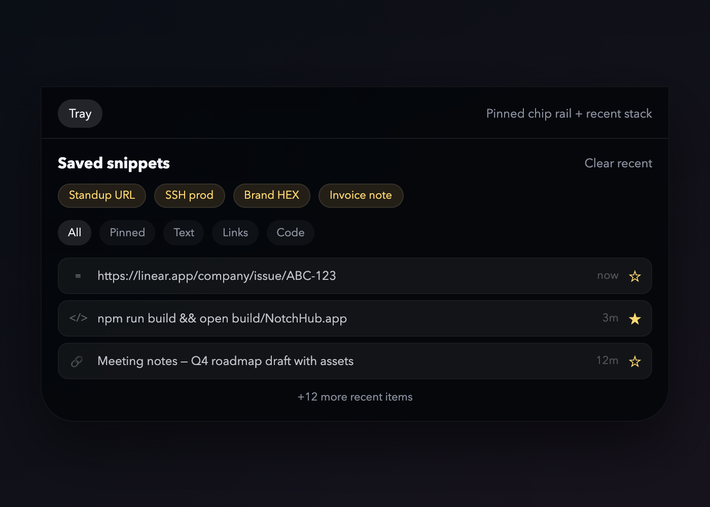

# NotchHub

A sleek, native macOS notch utility that brings dynamic media controls, system HUD sliders, clipboard history, a Pomodoro timer, and quick system actions directly to your MacBook's camera cutout.

Built in Swift and SwiftUI, NotchHub runs as a menu-bar-only agent app (`LSUIElement`) that overlays a borderless panel on top of the physical notch. It expands on hover, shows transient peek ribbons for system events, and lets you switch between five compact widget pages.

> Requires a MacBook with a notch (14" / 16" Pro or MacBook Air M2+). On non-notch Macs it falls back to a simulated notch area at the top of the main screen.

---

## Table of Contents

- [Features](#features)
- [Screenshots](#screenshots)
- [Requirements](#requirements)
- [Clone & Run](#clone--run)
- [Building a .app Bundle](#building-a-app-bundle)
- [Running Tests](#running-tests)
- [Architecture](#architecture)
- [Widgets](#widgets)
- [Services](#services)
- [Settings](#settings)
- [Peek Ribbons](#peek-ribbons)
- [Permissions](#permissions)
- [Project Structure](#project-structure)
- [Design Previews](#design-previews)
- [License](#license)

---

## Features

- **Hover-to-expand notch panel** with spring animations and a NotchNook-inspired shape (soft top corners, heavy bottom corners).
- **Five widget pages**, switchable via a tab bar that wraps around the notch:
  - **Nook** — now-playing media controls + dual clocks + volume/brightness sliders
  - **Actions** — quick system actions (DND, dark mode, lock, sleep, screenshot, mute, empty trash)
  - **Power** — MacBook battery + Bluetooth peripheral battery levels
  - **Tray** — clipboard history with search, kind filters, and saved items
  - **Timer** — full Pomodoro timer with work / short-break / long-break cycles
- **Transient peek ribbons** that appear over the notch for a few seconds when things happen (track change, clipboard copy, mute toggle, timer phase complete).
- **Pin mode** — keep the panel expanded so it doesn't collapse on mouse exit.
- **Launch at Login** via `SMAppService`.
- **Three panel size presets** — Compact, Standard, Roomy.
- **Configurable dual clocks** — local time + a reference timezone of your choice.
- **Scrubbable media progress bar** — drag to seek within the current track.
- **Pomodoro cycle-end prompt** — after a full cycle (focus + long break), the timer asks whether to repeat the session or end it.
- **Menu bar item** with Show / Settings / About / Quit.

---

## Screenshots

The following screenshots are rendered from the HTML design mockups in [`design-preview/`](design-preview/). They are close visual references for the live SwiftUI implementation.

### Nook Tab — Media Controls



### Tray Tab — Clipboard



> These are design mockups, not live captures. To see the actual app, run `./build-app.sh debug` and hover over the notch.

---

## Requirements

- macOS 13.0 (Ventura) or later
- Xcode 15.0+ **or** just the Swift 5.9 command-line tools
- A MacBook with a physical notch is recommended (otherwise a fallback notch area is simulated)

---

## Clone & Run

```bash
git clone https://github.com/<your-user>/NotchHub.git
cd NotchHub
```

### Quick build + launch

The fastest way to build, bundle, sign, and launch in one step:

```bash
./build-app.sh debug
```

This will:
1. Run `swift build -c debug`
2. Assemble a proper `.app` bundle in `build/NotchHub.app`
3. Generate the app icon from the asset catalog
4. Copy the `nowplaying.swift` helper into `Resources/Scripts/`
5. Ad-hoc code-sign the bundle (required for MediaRemote access)
6. Launch the app with `open`

### Run the already-built bundle

```bash
open build/NotchHub.app
```

### Build only (no launch)

```bash
swift build -c debug
```

The raw executable ends up in `.build/debug/NotchHub`. Note that running the raw executable directly will **not** have access to the `Resources/Scripts/nowplaying.swift` helper, so media controls will be limited. Prefer `build-app.sh` for a fully working app.

---

## Building a .app Bundle

`build-app.sh` handles everything. Usage:

```bash
./build-app.sh [debug|release]
```

- `debug` (default) — fast incremental builds
- `release` — optimized build

```bash
# Release build
./build-app.sh release
```

Output: `build/NotchHub.app`

### What the script does

| Step | Detail |
| --- | --- |
| `swift build` | Compiles the SPM target |
| Assemble bundle | Creates `Contents/MacOS/`, `Contents/Resources/` |
| Copy executable | `cp` the SPM binary into `MacOS/` |
| Copy Info.plist | Into `Contents/` |
| Generate icon | `iconutil -c icns` from the appiconset PNGs |
| Copy scripts | `Resources/Scripts/nowplaying.swift` into the bundle |
| Ad-hoc sign | `codesign --force --deep --sign -` |
| Launch | `open build/NotchHub.app` |

### Opening in Xcode

The repo includes an Xcode project generated from `project.yml` (XcodeGen format). If you have [XcodeGen](https://github.com/yonaskolb/XcodeGen) installed:

```bash
xcodegen generate
open NotchHub.xcodeproj
```

You can also open the `Package.swift` directly in Xcode and run from there, but the `build-app.sh` script is the canonical way to produce a working bundle.

---

## Running Tests

```bash
swift test
```

Tests live in `NotchHubTests/` and cover the `NotchViewModel` state machine (collapsed → hovering → expanded → pinned, peek auto-collapse, dismiss, click-outside).

---

## Architecture

NotchHub is a single-target Swift Package (`Package.swift`) built as an `LSUIElement` app — no Dock icon, no main window. All UI lives in a borderless `NSPanel` overlaid on the notch.

```
┌─────────────────────────────────────────────────────────┐
│  App                                                    │
│  NotchHubApp.swift .......... @main, LSUIElement        │
│  AppDelegate.swift ........... wires up everything      │
│  MenuBarController.swift ..... NSStatusItem menu        │
├─────────────────────────────────────────────────────────┤
│  Core                                                   │
│  NotchWindowController.swift  borderless NSPanel        │
│  NotchViewModel.swift ......... state machine           │
│  ScreenDetector.swift ......... finds the notched screen│
│  NotchShape.swift ............. custom panel shape      │
├─────────────────────────────────────────────────────────┤
│  Views                                                  │
│  NotchContainerView.swift ..... expanded + peek panels  │
│  CollapsedNotchView.swift ..... invisible hover target  │
│  Settings/SettingsView.swift .. settings window         │
├─────────────────────────────────────────────────────────┤
│  Widgets                                                │
│  WidgetRegistry.swift ......... page enum + ordering    │
│  MediaWidget/ ................. Nook tab                │
│  QuickActionsWidget/ .......... Actions tab             │
│  BatteryWidget/ ............... Power tab               │
│  ClipboardWidget/ ............. Tray tab                │
│  TimerWidget/ ................. Timer tab               │
│  HUDWidget/ ................... standalone HUD (unused) │
├─────────────────────────────────────────────────────────┤
│  Services                                               │
│  NowPlayingService.swift ...... MediaRemote via helper  │
│  VolumeService.swift .......... CoreAudio              │
│  BrightnessService.swift ...... DisplayServices (priv)  │
│  BatteryService.swift ......... IOKit                   │
│  ClipboardService.swift ....... NSPasteboard polling    │
│  TimerService.swift ........... Pomodoro timer logic    │
│  SystemActionsService.swift .... osascript / shell      │
│  SettingsService.swift ......... UserDefaults + SMApp   │
├─────────────────────────────────────────────────────────┤
│  Resources                                              │
│  Scripts/nowplaying.swift ...... MediaRemote helper     │
│  Assets.xcassets/ .............. app icon               │
│  Info.plist .................... LSUIElement, etc.      │
└─────────────────────────────────────────────────────────┘
```

### Notch state machine

`NotchViewModel` drives five states with Combine-friendly transitions:

```
collapsed ──hover──▶ hovering ──delay──▶ expanded ──pin──▶ pinned
   ▲                     │                   │
   └──────collapse───────┘                   │
   ▲                                         │
   └──────────────click outside / esc────────┘

expanded ──showPeek──▶ peeking(id) ──timer──▶ collapsed
```

- `hoverDelayMs` (default 200ms) gates hover → expand
- `collapseDelayMs` (default 400ms) gates expand → collapse on mouse exit
- `Esc` dismisses from any state
- Click outside the panel dismisses expanded/pinned states

---

## Widgets

### Nook (Media)

`MediaWidgetView.swift` — the default tab.

- Album artwork, track title, artist/album
- Play/pause, previous, next transport buttons
- **Scrubbable progress bar** — drag to seek
- Status chips (Playing / Paused, output device or album)
- Compact volume + brightness sliders (drag to adjust, tap icon to mute)
- Dual clock cards (local + reference timezone) with place names and `UTC +x` labels

Media controls are powered by a helper Swift script (`nowplaying.swift`) that calls the private `MediaRemote` framework. Because the app is ad-hoc signed, it can't call MediaRemote directly — the helper is run via `/usr/bin/swift` (which is Apple-signed).

### Actions

`QuickActionsWidgetView.swift` — a 4-column grid of system actions:

| Action | Method |
| --- | --- |
| Toggle Do Not Disturb | osascript → Control Center |
| Toggle Dark Mode | osascript → appearance preferences |
| Lock Screen | Cmd+Ctrl+Q via System Events |
| Sleep Display | `pmset displaysleepnow` |
| Screenshot | `screencapture -i` |
| Screenshot to Clipboard | `screencapture -i -c` |
| Empty Trash | osascript → Finder |
| Toggle Mute | NSAppleScript volume settings |

### Power

`BatteryWidgetView.swift`

- MacBook battery level with a circular progress ring
- Charging / plugged-in state
- Time remaining
- Bluetooth peripheral batteries (mouse, keyboard, trackpad, headphones, gamepad) via IOKit

### Tray

`ClipboardWidgetView.swift`

- Search field with live filtering
- Kind filter chips: All / Text / Links / Code
- **Saved items** — horizontal chip row, persisted across launches via `UserDefaults`
- **Recent items** — vertical list, tap to re-copy, star to save
- Auto-detects content kind (text / link / code) from the copied string
- Max 20 recent items

### Timer

`TimerWidgetView.swift` — a full Pomodoro timer.

- **Setup state**: preview dial, 2×2 rhythm cards (Focus / Short / Long / Cycle) with `+ / -` steppers, Start Focus button
- **Active state**: circular progress dial with time + percent, phase label, play/pause, skip, stop controls, session dots, round summary
- **Confirm state**: shown between phases; after a full cycle (long break done) it asks **Repeat Session** or **End Session**
- Phase colors: Focus = green, Short Break = blue, Long Break = purple
- Completion sound (`NSSound.glass`) + `UNUserNotification`

---

## Services

| Service | Framework | Purpose |
| --- | --- | --- |
| `NowPlayingService` | MediaRemote (private, via helper script) | Track info, playback controls, seek, shuffle, repeat |
| `VolumeService` | CoreAudio | Output volume, mute, device name, change listeners |
| `BrightnessService` | DisplayServices (private, `dlopen`) | Built-in display brightness |
| `BatteryService` | IOKit | Mac battery + Bluetooth peripheral batteries |
| `ClipboardService` | NSPasteboard | Clipboard history polling + saved items persistence |
| `TimerService` | Foundation + UserNotifications | Pomodoro timer state machine |
| `SystemActionsService` | osascript / shell | Quick system actions |
| `SettingsService` | UserDefaults + ServiceManagement | Persisted prefs + launch-at-login |

### nowplaying.swift helper

`NotchHub/Resources/Scripts/nowplaying.swift` is a standalone Swift script that loads `MediaRemote.framework` and outputs JSON to stdout. Commands:

```bash
swift nowplaying.swift info        # now-playing info as JSON
swift nowplaying.swift play        # toggle play/pause
swift nowplaying.swift next        # next track
swift nowplaying.swift prev        # previous track
swift nowplaying.swift seek 90     # seek to 90 seconds
```

The script is copied into the app bundle's `Resources/Scripts/` by `build-app.sh`.

---

## Settings

Open settings from the menu bar item → **Settings...** (or `Cmd+,` when the menu is open).

`SettingsView.swift` provides:

### General

- **Launch at Login** — registers/unregisters `SMAppService.mainApp`
- **Expand on Hover** — toggle hover-to-expand behavior
- **Peek Notifications** — toggle transient peek ribbons
- **Haptic Feedback** — toggle haptic feedback
- **Collapse Delay** — Instant / 0.3s / 0.5s / 1.0s

### Layout

- **Default Tab** — which widget page shows first (Nook / Actions / Power / Tray / Timer)
- **Panel Size** — Compact (580×352) / Standard (620×376) / Roomy (660×404)

### Nook Clock

- **Reference Zone** — timezone for the second clock card (Paris, Berlin, London, New York, Dubai, Kolkata, Tokyo, Sydney, UTC, and more)

### Widgets

Toggle which widget pages appear in the notch panel:
- Now Playing (Nook)
- Quick Actions
- Battery
- Clipboard
- Timer

All settings are persisted in `UserDefaults` and applied live.

---

## Peek Ribbons

When something happens, a compact ribbon slides down from the notch for a few seconds:

| Event | Title | Subtitle |
| --- | --- | --- |
| Clipboard copy | "Copied to Tray" | item preview |
| Item saved | "Saved to Tray" | item preview |
| Mute toggle | "Audio muted" / "Audio restored" | output device name |
| Track change | track title | artist |
| Timer phase complete | "Focus complete" / "Pomodoro cycle complete" | next phase or repeat/end prompt |

Peeks can be disabled globally in Settings → General → **Peek Notifications**.

---

## Permissions

NotchHub needs a few system permissions for full functionality. They are requested on first use:

| Permission | When needed | How to grant |
| --- | --- | --- |
| **Automation** | Quick Actions that target System Events / Control Center / Finder | System Settings → Privacy & Security → Automation |
| **Notifications** | Timer completion alerts | System Settings → Notifications → NotchHub |
| **Microphone / Camera** | Not required | — |

No special entitlements are currently declared (`NotchHub.entitlements` is empty). The app is ad-hoc signed, which is why MediaRemote is accessed via the Apple-signed `/usr/bin/swift` helper rather than directly.

---

## Project Structure

```
NotchHub/
├── Package.swift                  # SPM manifest
├── project.yml                    # XcodeGen spec
├── build-app.sh                   # build + bundle + sign + launch
├── README.md
├── LICENSE                        # MIT
├── NotchHub/
│   ├── App/
│   │   ├── NotchHubApp.swift      # @main, LSUIElement
│   │   ├── AppDelegate.swift      # wiring
│   │   └── MenuBarController.swift
│   ├── Core/
│   │   ├── NotchWindowController.swift
│   │   ├── NotchViewModel.swift
│   │   ├── ScreenDetector.swift
│   │   └── NotchShape.swift
│   ├── Views/
│   │   ├── NotchContainerView.swift
│   │   ├── CollapsedNotchView.swift
│   │   └── Settings/SettingsView.swift
│   ├── Widgets/
│   │   ├── NotchWidget.swift       # protocol
│   │   ├── WidgetRegistry.swift
│   │   ├── MediaWidget/MediaWidgetView.swift
│   │   ├── QuickActionsWidget/QuickActionsWidgetView.swift
│   │   ├── BatteryWidget/BatteryWidgetView.swift
│   │   ├── ClipboardWidget/ClipboardWidgetView.swift
│   │   ├── TimerWidget/TimerWidgetView.swift
│   │   └── HUDWidget/HUDWidgetView.swift
│   ├── Services/
│   │   ├── NowPlayingService.swift
│   │   ├── VolumeService.swift
│   │   ├── BrightnessService.swift
│   │   ├── BatteryService.swift
│   │   ├── ClipboardService.swift
│   │   ├── TimerService.swift
│   │   ├── SystemActionsService.swift
│   │   └── SettingsService.swift
│   ├── Utilities/
│   │   ├── GlassCard.swift         # shared card modifier
│   │   ├── AnimationConstants.swift
│   │   └── Extensions/NSScreen+Notch.swift
│   └── Resources/
│       ├── Info.plist
│       ├── NotchHub.entitlements
│       ├── Assets.xcassets/        # app icon
│       └── Scripts/nowplaying.swift
├── NotchHubTests/
│   └── NotchViewModelTests.swift
└── design-preview/                 # HTML mockups used during design
    ├── index.html
    ├── notch-ui-gallery.html
    ├── media-tray-premium.html
    ├── clipboard-chip-tray.html
    └── ...
```

---

## Design Previews

The `design-preview/` folder contains HTML mockups that were used to iterate on the UI before implementing it in SwiftUI. They are not part of the app build but are useful as visual references.

To preview them locally:

```bash
cd design-preview
python3 -m http.server 8765
# open http://localhost:8765
```

---

## License

MIT — see [LICENSE](LICENSE).

Copyright (c) 2026 Mohammed Shadab
